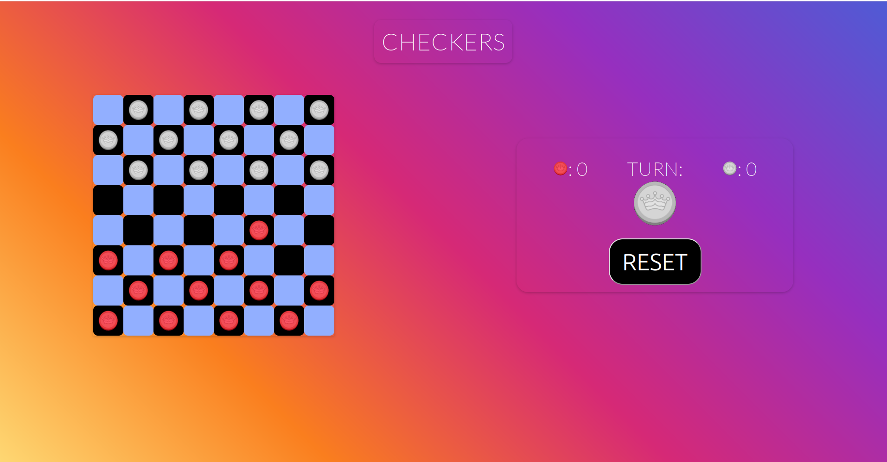

# **CHECKERS**

## Rules and General Overview

Checkers is a game that either involves two players or one player and a CPU. Each player has 12 chips positioned in every other square on either side (see image below). The chips move diagonally across the board, one space at a time, unless two special conditions are met (explained below). The chips come in two colours: red and white. It is convention that red always goes first. Pieces can be eliminated if a player (or CPU) "hops" diagonally over a chip of the opposite colour into an adjacent empty space. The game concludes when all chips of one colour are eliminated from the game.

## Special Conditions

The chips, in general, can only move in one direction and one spot at a time unless:

- A piece is eliminated.
- A piece reaches the other end of the board and becomes a king piece.
  - Becoming a king piece allows for that object to move in any diagonal direction if permitted.
- A piece cannot move in a given diagonal direction if the next two spots are occupied.

## Screenshots

## Technologies Used

- HTML
- CSS
- JavaScript

## Play the Game

The game can be accessed [here](https://pages.git.generalassemb.ly/martinnicola/project-1-checkers/). It requires two players. Remember, red always goes first. When the game concludes, a very popular song plays when the winner is announced. Good luck and follow the rules.

## Future Work

- **A working CPU**. The original plan for the game was to implement a working AI (CPU). However, due to time constraints, this was not possible.
- **Varying difficulty for the CPU**. A very simple implementation of the CPU would be to allow for the computer to hop randomly into any accessible space under the rules of the game. However, this may be considered "easy" mode. By coding for more targeted movement based on a player's pieces on the board, this allows for a higher difficulty.
